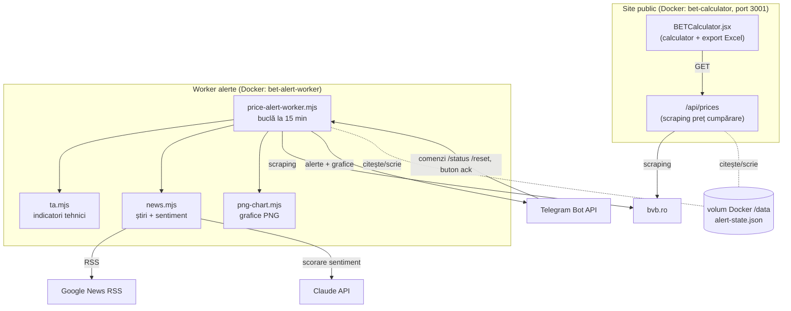

# Documentație — Calculator & Alerte BET

Documentație tehnică a aplicației **bet-calculator** (v2.7.0).
Pentru instrucțiuni rapide de rulare/deploy vezi [README.md](README.md); aici e descrisă întreaga arhitectură.

---

## 1. Ce este aplicația

Un sistem în două părți pentru indicele **BET** (Bursa de Valori București):

1. **Site public** — un calculator care distribuie o sumă în RON pe primii 10 constituenți ai
   indicelui BET, proporțional cu ponderile oficiale; arată câte acțiuni întregi poți cumpăra,
   costul și restul; exportă un raport Excel.
2. **Worker de alerte** (privat, prin Telegram) — monitorizează cele 10 acțiuni și trimite alerte
   când se întâmplă ceva ce merită atenție: scăderi de preț, schimbări de trend, **semnale tehnice**
   (analiză tehnică), **anunțuri oficiale** ale emitenților, context **fundamental** și **sentiment**
   din știri.

> **Important:** worker-ul este un instrument de **suport de decizie**, informativ. Nu execută ordine
> și nu oferă recomandări personalizate de investiție. Decizia și execuția rămân ale utilizatorului.

Stack: **Next.js 14** (App Router) + React 18 pentru site; **Node.js** pur pentru worker.
Filozofie: **zero dependențe externe** în afară de `xlsx` (pe site) — tot restul folosește
funcții native (`fetch`, `zlib`, `fs`). Nici scraping-ul BVB, nici graficele, nici apelul la Claude
API nu aduc pachete noi.

---

## 2. Arhitectură



**Două containere, o stare comună.** Site-ul și worker-ul rulează ca servicii separate în
`docker-compose`, dar partajează un fișier de stare (`/data/alert-state.json`) printr-un volum
Docker. Site-ul e expus pe portul host **3001**; worker-ul nu expune porturi.

---

## 3. Structura fișierelor

| Fișier | Rol |
|--------|-----|
| `app/page.jsx` | Pagina root — randează componenta calculatorului |
| `app/layout.jsx` | Layout HTML (`lang="ro"`, fonturi, temă dark) |
| `app/api/prices/route.js` | API: scraping BVB → top 10 + **preț de cumpărare (Ask)** |
| `components/BETCalculator.jsx` | Calculatorul (client component): input, alocare, tabel, export Excel |
| `scripts/price-alert-worker.mjs` | **Worker-ul** de alerte — bucla principală și toată logica de alertare |
| `scripts/ta.mjs` | Analiză tehnică pură (EMA, RSI, MACD, Bollinger, breakout, regresie, scor compozit) |
| `scripts/news.mjs` | Preluare știri (Google News RSS) + scorare sentiment (Claude API) |
| `scripts/png-chart.mjs` | Generator de grafic linie → PNG, doar cu `zlib` |
| `scripts/test.mjs` | Teste pre-deploy (structură, dependențe, Docker, securitate) |
| `scripts/health-check.mjs` | Health check post-deploy |
| `dockerfile` | Build multi-stage; imaginea rulează atât site-ul cât și worker-ul |
| `docker-compose.yml` | Cele 2 servicii + volumul de stare + variabilele de mediu |

---

## 4. Site-ul public (calculatorul)

### Logica de alocare
1. Utilizatorul introduce o sumă (RON).
2. Ponderile celor 10 constituenți sunt **normalizate** la 100%.
3. Pentru fiecare: `alocat = sumă × pondere; acțiuni = max(1, floor(alocat / preț))`.
4. Se calculează costul real, restul nealocat și eventuala depășire (când minimul de 1
   acțiune/companie depășește suma).
5. Buton de export **Excel** (`xlsx`) cu raportul complet.

### Prețul afișat = **preț de cumpărare (Ask)**
API-ul `/api/prices` întoarce, pentru fiecare acțiune, prețul **„Ask"** (cotația la care cumperi
efectiv), nu „Ultimul pret". Vezi §6 pentru sursa exactă.

### Detalii importante de implementare
- **`cache: "no-store"`** pe fetch-urile către BVB — altfel Next.js cache-uiește răspunsurile și
  servește prețuri vechi.
- **Auto-încărcare** la deschidere: prețurile live se aduc automat, fără apăsarea unui buton.
- **Badge de versiune** (`v2.7.0`) în header — confirmă vizual că rulează codul nou după un deploy.
- Site-ul **nu** are UI de alerte (e public); controlul alertelor se face exclusiv din Telegram.

---

## 5. Worker-ul de alerte

Un proces Node care rulează non-stop. Are două bucle:
- **`priceLoop`** — la fiecare `ALERT_INTERVAL_MIN` (implicit 15 min): rulează, în ordine,
  `checkAnnouncements()` → `checkNews()` → `checkPrices()`.
- **`telegramLoop`** — la ~1s (long-poll `getUpdates`): procesează butoanele inline și comenzile text.

Verificările de **preț/trend/semnal** rulează doar cât e **bursa deschisă** (L–V,
`MARKET_OPEN_HOUR`–`MARKET_CLOSE_HOUR`, fus `ALERT_TZ`). Anunțurile și știrile rulează oricând.

### 5.1 Alerte de scădere (prag)
Alertă când o acțiune scade cu ≥ `ALERT_DROP_STEP`% (implicit 1%) față de **închiderea de ieri**
(`Pret referinta`). Re-alertă la fiecare treaptă suplimentară (−1%, −2%, −3%…). Fiecare alertă are un
buton inline **„🔕 Oprește alertele"**. Resetare automată la începutul fiecărei zile de tranzacționare.

### 5.2 Trend intraday (cu grafic)
Pe eșantioanele zilei, regresie liniară pe o fereastră glisantă (`TREND_WINDOW`, ~2h). Trend „clar"
= mișcare ≥ `TREND_MIN_MOVE`% **și** R² ≥ `TREND_MIN_R2`. Alertă **doar la schimbarea de stare**
(neutru→sus/jos sau inversare), cu un **grafic PNG** al zilei.

### 5.3 Semnale tehnice (Faza 1)
Worker-ul acumulează prețul în **bare de 15 min** (buffer multi-zi). `ta.mjs` calculează:
**EMA 9/21/50, RSI(14) Wilder, MACD(12,26,9), Bollinger(20,2), breakout pe 20 bare, momentum (ROC),
volatilitate** și le combină într-un **scor de la −100 la +100** cu motive text.

- **STRONG_BUY** (scor ≥ `SIGNAL_STRONG_BUY`, implicit +55, cu ≥ `SIGNAL_MIN_CONFIRMS` confirmări)
- **STRONG_SELL / RISC** (scor ≤ `SIGNAL_STRONG_SELL`, implicit −55)

Alertă la schimbarea de stare, cu **cooldown** per acțiune (`SIGNAL_COOLDOWN_MIN`, implicit 45 min)
și **grafic adnotat** (preț + liniile EMA9/21/50). Supracumpărarea/supravânzarea (RSI) penalizează
doar când momentum-ul se răsucește, ca să nu blocheze breakout-urile puternice.
Se „încălzește" în ~1–2 zile (are nevoie de destule bare pentru EMA50/MACD).

### 5.4 Anunțuri oficiale emitenți (Faza 2)
`checkAnnouncements()` monitorizează feed-ul global de **rapoarte curente** BVB, filtrează după cele
10 acțiuni și trimite **instant** o alertă la orice raport nou (convocări AGA, rezultate financiare,
tranzacții ale conducerii etc.). La prima pornire face „seed" (marchează tot ca văzut, fără backlog).

### 5.5 Fundamentale (Faza 2)
Din pagina de detaliu a fiecărui emitent se extrag **PER (P/E), P/BV, EPS, DIVY (randament dividend),
Capitalizare** (se păstrează ultima valoare validă). Apar în `/status` și ca context în alertele de
semnal. Sunt context de calitate/valoare, nu declanșator (se schimbă trimestrial).

### 5.6 Sentiment din știri (Faza 3)
`checkNews()` (implicit ~o dată pe oră, `NEWS_EVERY_TICKS`) caută știri RO per companie prin
**Google News RSS**, scorează titlurile **noi** cu **Claude API** (scor −1…+1) și alertează când
sentimentul e puternic (|scor| ≥ `SENTIMENT_MIN_ABS`, implicit 0.5). Doar știrile noi sunt scorate
(dedup + seed), deci costul e mic. Fără `ANTHROPIC_API_KEY`, funcția se dezactivează curat.

---

## 6. Surse de date BVB (scraping)

Tot cu regex, fără parser HTML extern.

| Sursă | URL | Ce extragem |
|-------|-----|-------------|
| Profil indice | `.../Indices/IndicesProfiles.aspx?i=BET` | Compoziția + ponderile (tabelul `id="gvC"`) → top 10 |
| Detaliu instrument | `.../Details/FinancialInstrumentsDetails.aspx?s=SIMBOL` | **Bid / Ask** (preț cumpărare), **Ultimul pret**, **Pret referinta**, **PER/P/BV/EPS/DIVY/Capitalizare** |
| Rapoarte curente | `.../SelectedData/CurrentReports` | Feed global de anunțuri (simbol, titlu, dată, categorie) |
| Știri | Google News RSS (`news.google.com/rss/search`) | Titluri de știri RO per companie |

**Distincția de preț** (a fost sursa mai multor confuzii):
- **Pret referinta** = închiderea de ieri (baza pentru alerta de scădere).
- **Ultimul pret** = ultima tranzacție (baza pentru trend).
- **Ask** (din „Bid / Ask") = prețul de **cumpărare** curent (ce afișează site-ul).

---

## 7. Interfața Telegram

Controlul e **exclusiv** prin Telegram (site-ul e public, fără butoane de alerte).

| Comandă / acțiune | Efect |
|-------------------|-------|
| Buton inline **🔕 Oprește alertele** (sub o alertă de scădere) | Oprește alertele pentru acea acțiune |
| `/reset SIMBOL` | Reactivează alertele pentru o acțiune (ex. `/reset TLV`) |
| `/reset all` | Reactivează toate acțiunile |
| `/status` | Tabel cu toate cele 10: semnal tehnic + scor, trend 📈/📉, variație zi, P/E, dividend, sentiment 📰 |
| `/start`, `/help` | Meniu scurt de comenzi |

Alertele oprite se reactivează oricum automat în fiecare dimineață de tranzacționare.

---

## 8. Configurare (variabile de mediu)

Toate se pun în `.env` (copiază din `.env.example`).

| Variabilă | Default | Descriere |
|-----------|---------|-----------|
| `PORT` | `3000` | Portul host al site-ului (în producție e setat `3001`) |
| `NODE_ENV` | `production` | Mediul |
| `TELEGRAM_BOT_TOKEN` | — | Token bot (@BotFather) — necesar pentru alerte |
| `TELEGRAM_CHAT_ID` | — | Chat ID-ul unde vin alertele |
| `ALERT_INTERVAL_MIN` | `15` | Interval de verificare (minute) |
| `ALERT_DROP_STEP` | `1` | Pragul de scădere (%) |
| `ALERT_TZ` | `Europe/Bucharest` | Fus orar pentru programul bursei |
| `MARKET_OPEN_HOUR` / `MARKET_CLOSE_HOUR` | `10` / `18` | Programul bursei |
| `TREND_ENABLED` | `true` | Activează alertele de trend |
| `TREND_WINDOW` | `8` | Eșantioane în fereastra de trend (~2h) |
| `TREND_MIN_MOVE` | `1.0` | Mișcare minimă (%) pentru „trend clar" |
| `TREND_MIN_R2` | `0.6` | Cât de „curat" trebuie să fie trendul (0..1) |
| `SIGNAL_ENABLED` | `true` | Activează semnalele tehnice |
| `SIGNAL_STRONG_BUY` / `SIGNAL_STRONG_SELL` | `55` / `-55` | Praguri de scor |
| `SIGNAL_MIN_CONFIRMS` | `3` | Confirmări minime pentru un semnal puternic |
| `SIGNAL_COOLDOWN_MIN` | `45` | Minute între semnale pentru aceeași acțiune |
| `ANNOUNCE_ENABLED` | `true` | Activează alertele de anunțuri BVB |
| `SENTIMENT_ENABLED` | `true` | Activează sentimentul din știri |
| `ANTHROPIC_API_KEY` | — | Cheia Claude API (fără ea, sentimentul e dezactivat) |
| `SENTIMENT_MODEL` | `claude-opus-5` | Model de scorare (mai ieftin: `claude-haiku-4-5`) |
| `SENTIMENT_MIN_ABS` | `0.5` | Prag \|scor\| pentru alertă de sentiment |
| `NEWS_LOOKBACK_DAYS` | `3` | Câte zile în urmă se caută știri |
| `NEWS_EVERY_TICKS` | `4` | La câte tick-uri se verifică știrile (4 ≈ o dată/oră) |

---

## 9. Modelul de stare (`/data/alert-state.json`)

Fișier JSON partajat, scris atomic (temp + rename). Structură (simplificat):

```jsonc
{
  "day": "2026-08-03",              // ziua curentă (Europe/Bucharest) — pt. reset zilnic
  "updatedAt": "…ISO…",
  "tgOffset": 123,                   // offset getUpdates Telegram
  "annSeeded": true, "annSeen": [],  // dedup anunțuri
  "newsSeeded": true, "newsSeen": [],// dedup știri
  "symbols": {
    "TLV": {
      "name": "…", "ref": 39.7, "last": 39.7, "dropPct": 0,
      "level": 0, "lastAlerted": 0, "muted": false,   // alertă scădere
      "history": [ … ], "trend": "up", "trendNotified": "up", // trend intraday
      "bars": [ … ], "sigScore": 60, "sigStateNow": "STRONG_BUY", // semnal tehnic
      "sigNotified": "STRONG_BUY", "lastSigAt": 0,
      "fund": { "per": 9.88, "pbv": 1.98, "eps": 3.74, "divy": 5.1 }, // fundamentale
      "sentiment": { "score": -0.6, "label": "negativ", "summary": "…" } // sentiment
    }
  }
}
```

Scrierile concurente (worker vs. comenzi Telegram) sunt gestionate prin **reload + merge** pe câmpuri
proprii, ca să nu se suprascrie reciproc.

---

## 10. Deploy

Producție: server `31.220.93.242`, director `~/BET calculator/bet-deploy`, port host **3001**.

```bash
cd "/home/dragos.nimu/BET calculator/bet-deploy"
git fetch origin && git reset --hard origin/main
# completează .env (token Telegram, opțional ANTHROPIC_API_KEY / SENTIMENT_MODEL)
docker compose up -d --build
```

Verificare:
```bash
curl -s http://localhost:3001/api/prices | grep -o '"version":"[^"]*"'   # ex. "2.7.0"
docker compose ps                                # bet-calculator + bet-alert-worker (Up)
docker compose logs --tail=20 bet-alert-worker
```

**Note importante:**
- `docker-compose.yml` fixează `dockerfile: dockerfile` (lowercase) ca să nu fie umbrit de un
  `Dockerfile` vechi rămas pe server.
- La probleme de cache vechi: `docker compose build --no-cache && docker compose up -d`.
- Badge-ul de versiune din header confirmă că rulează codul nou.

---

## 11. Securitate & bune practici

- **Fără secrete în repo.** `.gitignore` exclude `.env`, `token*.txt`, `telegram*.txt`, imagini.
  Verifică `git status` înainte de fiecare commit.
- **Nu executa ordine.** Aplicația nu tranzacționează; toate alertele sunt informative.
- **Rotește cheile expuse.** Dacă un token (GitHub/Telegram/Anthropic) a fost postat vreodată în
  clar, revocă-l și generează altul.
- **Site public.** Nu expune date sau butoane de alerte pe site; controlul e privat, prin Telegram.

---

## 12. Testare

```bash
npm test              # teste pre-deploy (structură, deps, Docker, securitate)
npm run test:health   # health check pe o instanță pornită
```

Logica worker-ului (indicatori, trend, semnale, sentiment, anunțuri) e testabilă izolat — modulele
`ta.mjs`, `news.mjs`, `png-chart.mjs` exportă funcții pure, iar `price-alert-worker.mjs` rulează
buclele doar când e executat direct (poate fi importat în teste).

---

## 13. Istoric versiuni

| Versiune | Ce a adus |
|----------|-----------|
| 2.0–2.1 | Calculator + scraping preț real (trecere de la „Preț ref." la „Ask"), fix cache Next.js |
| 2.2 | Alerte Telegram de scădere (prag) + comenzi/buton |
| 2.3 | Trend intraday cu grafic PNG + indicator în panou (ulterior scos de pe site) |
| 2.4 | Scoaterea UI-ului de alerte de pe site (public); control mutat în Telegram |
| 2.5 | **Faza 1** — motor de analiză tehnică + semnale STRONG_BUY/SELL cu grafic adnotat |
| 2.6 | **Faza 2** — anunțuri oficiale BVB + fundamentale |
| 2.7 | **Faza 3** — sentiment din știri (Google News + Claude API) |

---

## 14. Disclaimer

Ponderile provin din compoziția oficială BET (bvb.ro), normalizate la 100% pentru top 10. Semnalele
tehnice, fundamentale și de sentiment sunt **informative** și **nu constituie recomandare de
investiție**. Aplicația nu execută ordine — decizia și execuția rămân ale utilizatorului.
